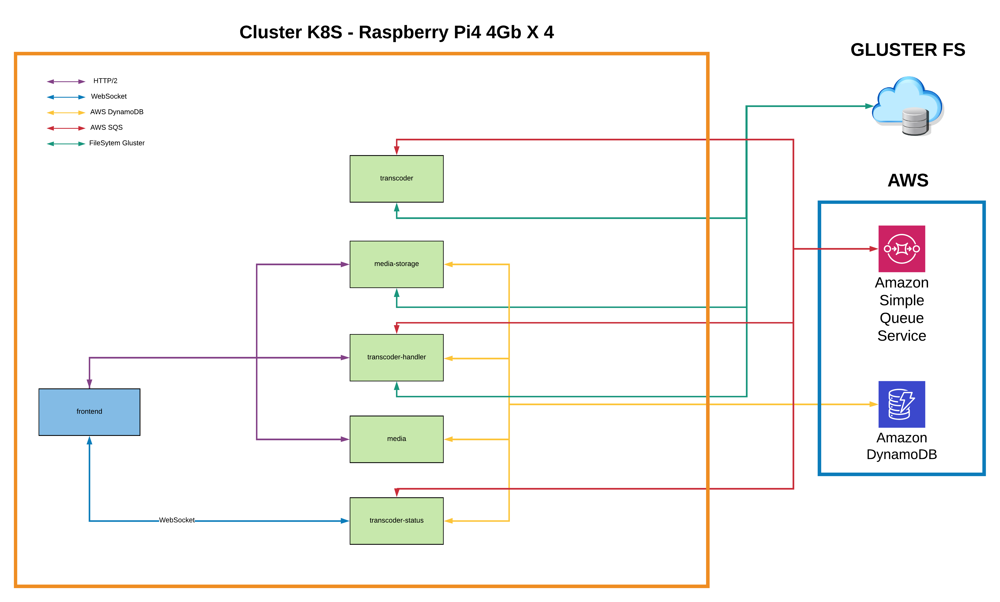

# [ElasticTranscoder](https://videotranscoding.es)


## Elastic application for transcode videos using FFMPEG
### Architecture and components

- **Frontend** use Angular 10 and material.
- **Transcoder**: Springboot application (JDK 13) which read a SQS queue to transcode the video
- **Media-Storage**: Springboot application (JDK 13) connected to filesystem or glusterfs to serve the content or upload it.
- **Media**: Springboot application (JDK 13) connected to dynamodb for crud requests of the original and transcode media.
- **Transcoder-Status**: Springboot application (JDK 13) connected to dynamodb and sqs to read requests of transcoder-status queue.
- **Transcoder-Handler**: Springboot application (JDK 13). Handler of all media.
### Configuration Mandatory
- All microservices, including frontend, used [Okta](https://www.okta.com/) to secured it. Please, [read here](doc/okta.md) to configure it for this proyect or if you want use it.
- For configure AWS SQS and DynamoDB use [this](doc/aws.md).

### Configuration Optional
- The glusterFS cluster is optional, but mandatory if you want externalise the filesystem. [Read here](doc/gluster.md) to configure it.


### Requirements for deploy it
- Kubernetes cluster ([microk8s](https://microk8s.io/))
- [Helm V3](https://helm.sh/docs/intro/install/) on your kubernetes cluster.
- LoadBalancer (microk8s--> `microk8s enable metallb`)
### Deploy:
Need [Helm V3](https://helm.sh/docs/intro/install/) on your kubernetes cluster.

Install traefik:
```
helm repo add traefik https://helm.traefik.io/traefik
```
You can update the chart repository by running:
```
helm repo update
```
And install it with the helm command line:
```
helm install traefik traefik/traefik
```

Install CRDs
```
kubectl apply -f https://mastercloudapps-projects.github.io/ElasticTranscoder/charts/crds/cloudwatch-adapter.yaml
kubectl apply -f https://mastercloudapps-projects.github.io/ElasticTranscoder/charts/crds/ingressroute.yaml 
```
Install elastictranscoder
```
helm repo add elastictranscoder https://mastercloudapps-projects.github.io/ElasticTranscoder/charts
helm repo update
```
Download /charts/elastic-transcoder/values.yaml and edited with your values
```
helm install elastictranscoder elastictranscoder/elastic-transcoder -f values.yaml 
```

####


### Next release:

* Support HLS transcode
* Support audio transcode (video--> to only audio , audio --> audio)
* Fix delete-media flow (parent folders not deleted)
* Fix transcoder for support speed, filesize and bitrate
* Fix transcoder-handler to support threads, select audio bitrate and CRF (VideoTranscodeServiceImpl:108)