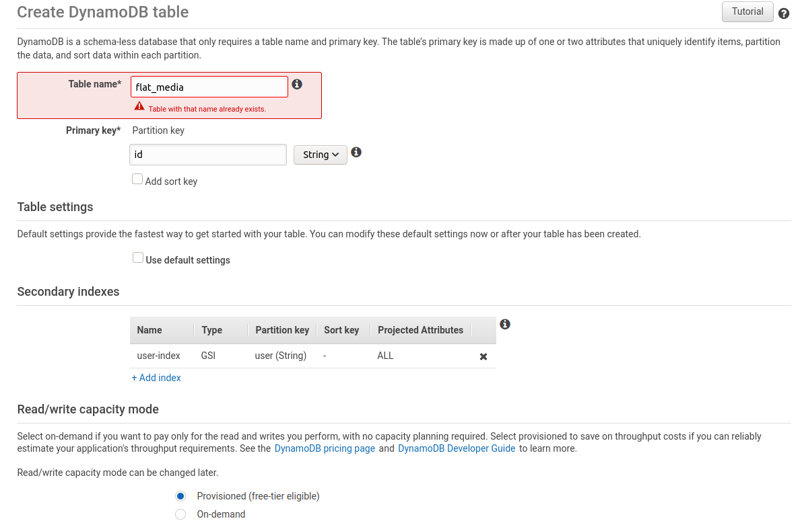

# Create and account on AWS
[AWS sign up](https://portal.aws.amazon.com/billing/signup?type=enterprise)
# AWS SQS(free tier) configuration for elastictranscoder
Go to services, SQS, create queue and create 5 queues with this specifications (values with default values except especified):
* Standard:
  * Name: delete-file
* Standard:
  * Name: transcoder
  * Default visibility timeout: 12 hours
* Standard:
  * Name: transcoder-handler
* Standard:
  * Name: media-info
* FIFO:
  * Name: transcoder-status
  * Content-based deduplication: Enabled

# AWS DynamoDB(free tier) configuration for elastictranscoder
Got to services, DynamoDB, create table, with this specifications:

* FlatMedia: 
  * table name: flat_media
  * primary key: id
  * secondary index:
    * user-index (projected attributes all) 
* TranscodeMedia: 
  * table name: flat_media
  * primary key: id
  * secondary index:
    * user (user-index,projected attributes all) 
    * flatMediaId (flatMediaId-index,projected attributes all)
  

