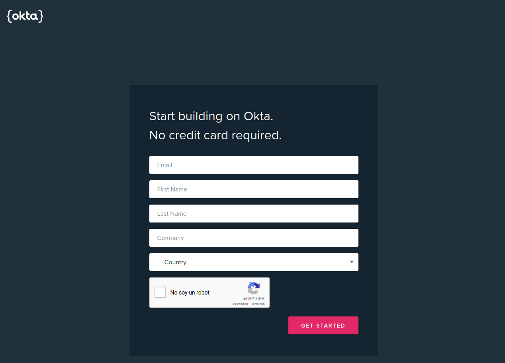

# Okta
Go to [okta developer](https://developer.okta.com/signup/) and create an developer account.

Fill, if you want, about yourself

Verify your email address and activate your okta developer account.
## Backend login
Create new java application

Change login redirect uri http://localhost:8080/authorization-code/callback to http://localhost:8080/login/oauth2/code/okta

Copy the cliend id and client secret to use on helm or the microservice.
## Frontend login
Create new angular application and change base, login redirect and logout redirect uris.

Now copy the client to use on helm or frontend application.